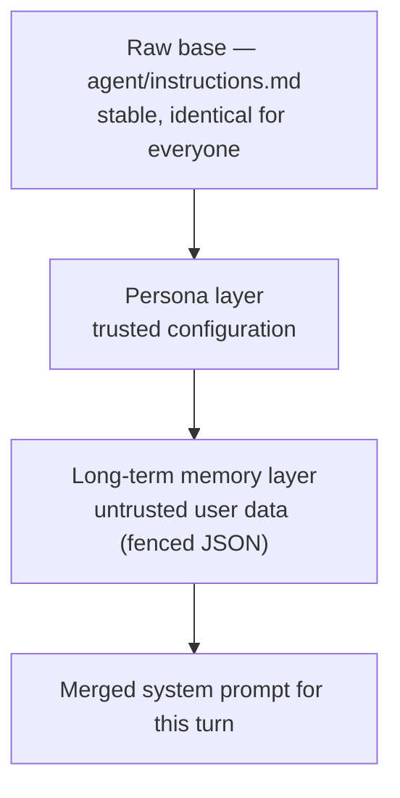
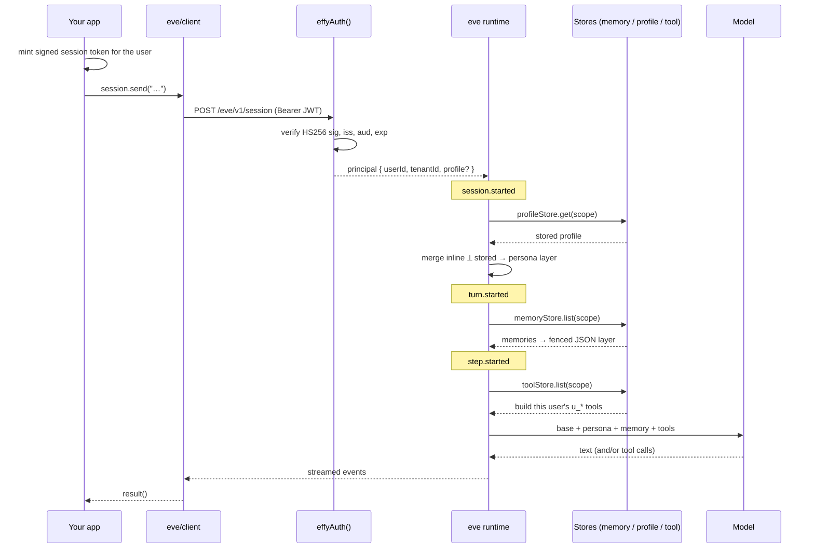

effy is a thin tenancy layer over an otherwise ordinary eve agent. This page traces a request end to end: how a token becomes a scope, and how that scope assembles the system prompt and tool set for a single turn.

## The raw base, layered per session

The base agent (`agent/instructions.md`) is small and identical for every user. effy personalizes it by **appending** context that is resolved per session from the verified scope:



The two added layers carry **different trust levels**, and effy renders them differently on purpose:

- A **persona** is trusted configuration — signed by your management layer — so it is rendered as instructions the agent should follow.
- **Memory** is untrusted user data, so it is rendered as fenced JSON the model is explicitly told not to treat as instructions.

This separation is the core security property of the prompt. See [Personas](/concepts/personas) and [Memory](/concepts/memory) for each layer.

## Lifecycle: when each layer resolves

eve emits lifecycle events as a session runs. effy attaches each personalization layer to the event whose cadence it needs, using `defineDynamic` resolvers:

| Layer | Resolves on | Why this cadence |
| --- | --- | --- |
| **Persona** | `session.started` | A persona is stable for the whole conversation, so it resolves once. |
| **Long-term memory** | `turn.started` | Memory written earlier in the session must be visible on the next turn. |
| **Per-user tools** | `step.started` | The tool set is rebuilt before each model call, so a tool authored mid-conversation is immediately callable. |

## A turn, end to end

This is the full path of one message, from your app to the model and back:



Every store read takes the `scope` derived from `ctx.session.auth.current` — the verified principal. The model never supplies the tenant or user.

## Multi-tenancy by composition

eve has no tenant subsystem. effy builds one from a handful of primitives:

| Concern | How effy does it |
| --- | --- |
| **Identity** | A custom route `AuthFn` (`lib/effy-auth.ts`) puts `(tenantId, userId)` on the principal. |
| **Memory** | A dynamic-instructions resolver loads it per turn; `remember` / `list_memories` / `forget` tools write it. |
| **Persona** | A dynamic-instructions resolver merges an inline-or-stored profile onto the base prompt. |
| **Sandbox** | eve gives every session its own sandbox; `sandbox/sandbox.ts` tags it and locks egress. |
| **Tooling** | A `defineDynamic` resolver builds each user's own tools from their scope; no other tenant can see or run them. |

## Project layout

```text
agent/
  agent.ts                 base model config
  instructions.md          RAW base prompt (stable, every user)
  instructions/
    persona.ts             session.started → inline-or-stored profile as persona
    memory.ts              turn.started → long-term memories (fenced JSON)
  tools/
    remember.ts            save one durable fact for the current user
    list_memories.ts       list the current user's memories
    forget.ts              delete one memory (requires approval)
    create_tool.ts         author a personal tool (requires approval)
    list_custom_tools.ts   list the current user's personal tools
    delete_tool.ts         delete a personal tool (requires approval)
    custom.ts              defineDynamic → build each user's tools from their scope
  channels/
    eve.ts                 HTTP channel guarded by effyAuth()
  sandbox/
    sandbox.ts             deny-all egress default + per-session tenant marker
  lib/
    scope.ts               TenantScope + storage key
    tenant.ts              requireTenantCaller / tryTenantCaller / readInlineProfile
    effy-auth.ts           route auth: JWT (+ dev headers)
    effy-auth.test.ts      self-check for the auth path
    memory-store.ts        MemoryStore + in-memory impl
    profile-store.ts       ProfileStore + in-memory impl
    tool-store.ts          ToolStore + in-memory impl
    run-user-tool.ts       static runner: executes user tool code in the sandbox
```

<Note>
  The three stores ship as **in-memory** reference implementations — correct for `eve dev` and a single instance, but not durable or shared across processes. Each hides behind a small interface, so swapping in Postgres, a KV store, or a vector store changes nothing else. See [Deployment](/guides/deployment#replace-the-in-memory-stores).
</Note>

## What to read next

<Columns cols={2}>
  <Card title="Multi-tenancy" icon="building" href="/concepts/multi-tenancy">
    How a verified scope isolates every tenant.
  </Card>
  <Card title="Per-user tools" icon="wrench" href="/concepts/custom-tools">
    The most intricate subsystem, diagrammed.
  </Card>
</Columns>
