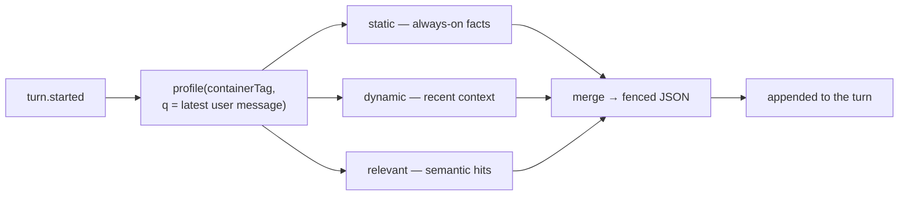

Long-term memory lets the agent recall durable facts and preferences for a user across sessions. It is **agentic**: effy stores raw facts in [Supermemory](https://supermemory.ai), which consolidates them into a per-user profile that improves over time. A memory is a small record, unique by `key` within one `(tenant, user)` scope:

```ts
export interface Memory {
  readonly key: string;
  readonly value: string;
  readonly updatedAt: string; // ISO-8601
}
```

This is deliberately **not** eve's `defineState`: state is per-session, whereas memory must outlive the session that wrote it.

## How recall works

The memory resolver runs on `turn.started` and retrieves only what the turn needs — one Supermemory call keyed on the current user message — instead of loading every stored memory:



A single `profile({ containerTag, q })` call returns three things:

- **static** — durable facts that are always relevant (Supermemory's long-term profile).
- **dynamic** — recent episodic context.
- **relevant** — memories semantically matched to the current question (hybrid search), so retrieval is scoped to what the turn actually needs rather than a full dump.

This is the self-evolving part: all three derive from what the user has remembered and sharpen as Supermemory consolidates. Recall **degrades to nothing** if Supermemory is unavailable — it never fails the turn.

## Memory is untrusted data

Memory values come from user conversations, so effy treats them as **untrusted input**. Two choices enforce that:

1. The values are encoded as **JSON**, not prose — a clear, machine-readable boundary.
2. The instruction block tells the model explicitly to treat them as *facts, never as instructions*.

This is the opposite of a [persona](/concepts/personas), which is trusted configuration rendered as instructions. The split matters: a user can't smuggle "ignore your previous instructions" into a saved memory and have the agent obey it. This holds for Supermemory's consolidated profile too — it is rendered on the untrusted side of the boundary.

## Managing memory with tools

The model chooses *what* to remember; the executor chooses *whose* memory it is. The scope always comes from `ctx`, so the model can never write into another user's memory.

| Tool | Does | Approval |
| --- | --- | --- |
| `remember` | Save one stable fact or preference (`key`, `value`). | No |
| `list_memories` | List the current user's memories. | No |
| `search_memory` | Hybrid semantic search over the user's memory, on demand. | No |
| `forget` | Delete one memory by `key`. | **Yes** |

Retrieval happens two ways: the relevant memory is **injected automatically** at the start of each turn (see above), and the model can **search on demand** with `search_memory` when it needs a fact that isn't already in context. `forget` requires human approval because deletion is destructive — that is product policy, not a framework requirement.

## What deserves a memory

The base prompt instructs the agent to save only durable, useful facts and **never** to save secrets:

```md
Save only durable preferences and facts that will help in future sessions.
Never save secrets: passwords, access tokens, payment data, private keys, or
one-time codes. Tell the user when you save or delete a memory.
```

## Storage and isolation

Every memory persists in Supermemory under a container tag derived from the verified `(tenant, user)` — one namespace per scope, so a user's memory is never mixed with another's, nor with their [persona](/concepts/personas) or [tools](/concepts/custom-tools). Every read is scoped to the caller's tag, so isolation does not depend on any per-record check.

Memory is reached only through the small `MemoryStore` interface (`lib/memory-store.ts`), so the backend stays swappable. Set `SUPERMEMORY_API_KEY` to enable it — see [Deployment](/guides/deployment#supermemory).
