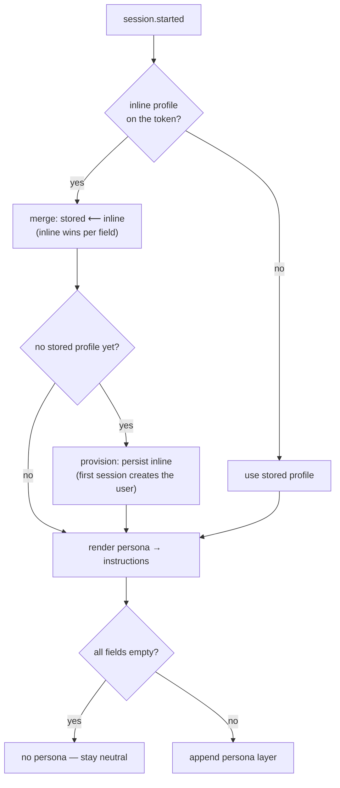

A persona turns the raw base agent into *this user's* assistant. It is **trusted configuration** — authored by your management layer, never by the model or the end user — so effy renders it as instructions the agent adopts for the conversation.

## The profile shape

A profile has three optional fields, validated with Zod:

```ts
export const ProfileSchema = z
  .object({
    name: z.string().min(1).max(120).optional(),         // "Ada"
    personality: z.string().min(1).max(4000).optional(), // voice, tone, character
    instructions: z.string().min(1).max(8000).optional(),// durable standing instructions
  })
  .strict();
```

When none of the three is set, no persona is added and the base agent stays neutral.

## Two ways to inject a persona

A persona can arrive **by parameter** at session creation, or from a **persisted store**. The resolver merges them, with inline winning field-by-field.



### By parameter (no persistence)

The management layer authenticates the session and passes the profile inline — a `profile` JWT claim in production, or the `x-effy-profile` header in local dev. Good for stateless callers that already hold the user's configuration.

### Persisted profile store

The store is keyed by `(tenant, user)`. The first session that supplies an inline profile **provisions** the user — it persists the profile — so later sessions can omit the parameter and inherit it:

```ts
let profile: Profile | null = stored;
if (inline) {
  profile = { ...stored, ...inline };   // inline wins field-by-field
  if (!stored) await profileStore.put(scope, inline);  // provision on first use
}
```

## When it resolves

The persona resolver runs on `session.started` — a persona is stable for the whole conversation, so it resolves once rather than per turn. The rendered output is a short instruction block:

```text
The following configures your persona for the current user. Adopt it as your
identity and standing instructions for the whole conversation.

Your name is Ada.

## Personality

Warm and concise.

## Standing instructions

Always answer in metric units.
```

## Why a persona is rendered as instructions

This is the deliberate counterpart to [memory](/concepts/memory). A persona is signed by your management layer, so effy trusts it and renders it as instructions to follow. Memory is user-provided data, so it is fenced as JSON the model must not treat as instructions. Keeping the two on different trust levels is what lets you personalize aggressively without letting a user's saved text rewrite the agent's behavior.

<Warning>
  Treat the inline profile path as a trust boundary you own. Because a persona becomes instructions, only your management layer should be able to set it — never the end user directly. In production it rides inside the [signed token](/guides/authentication); the `x-effy-profile` header works **only** under `EFFY_DEV_AUTH=1`.
</Warning>
