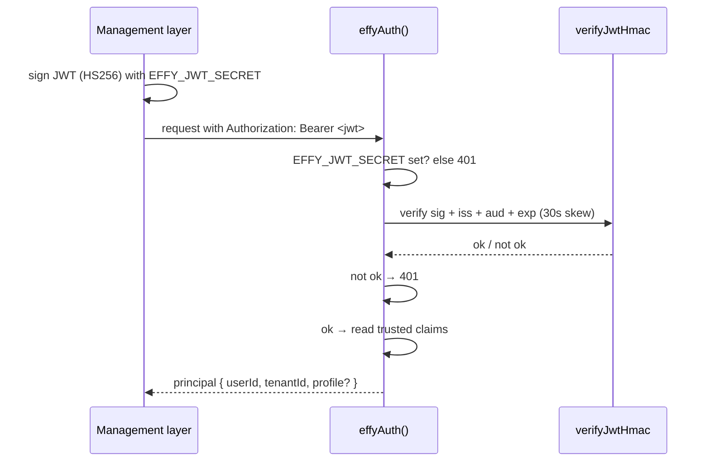

effy's route auth (`lib/effy-auth.ts`) is the **only** place a tenant identity enters the system. Every accepted request becomes a `user` principal carrying the `(tenantId, userId)` that scopes memory, persona, sandbox, and tooling.

It tries two paths, in order:

1. **Bearer JWT** — production and SDK integration. Your management layer mints an HMAC-signed token.
2. **Dev headers** — local only, opt-in. When `EFFY_DEV_AUTH=1` and no token is present, identity comes from `x-effy-*` headers.

With neither a valid token nor dev mode, the request is rejected with `401`. effy **fails closed**: an invalid token is rejected, never downgraded to anonymous.

## How a token is verified



The payload is only decoded **after** the signature verifies, so the claims it reads are authentic.

## The session token contract

`effyAuth()` verifies an HS256 bearer JWT, then maps its claims onto the principal:

| Claim | Required | Becomes |
| --- | --- | --- |
| `sub` | yes | `userId` (the principal id) |
| `tenant_id` | yes | `tenantId` |
| `iss` | yes | must equal `EFFY_JWT_ISSUER` (default `effy`) |
| `aud` | yes | must equal `EFFY_JWT_AUDIENCE` (default `effy-agent`) |
| `exp` | yes | expiry (verified, 30s clock skew) |
| `profile` | no | inline [persona](/concepts/personas) `{ name?, personality?, instructions? }` |

## Mint a token

Sign it server-side with any JWT library, using `EFFY_JWT_SECRET`. Keep the lifetime short:

```ts
import jwt from "jsonwebtoken"; // or jose, or any HS256 signer

export function mintEffySessionToken(user: { id: string; tenantId: string }) {
  return jwt.sign(
    {
      iss: "effy",
      aud: "effy-agent",
      sub: user.id,
      tenant_id: user.tenantId,
      exp: Math.floor(Date.now() / 1000) + 600, // 10 minutes
      // Optional inline persona — trusted config, set only by your backend.
      profile: { name: "Ada", personality: "Warm and concise." },
    },
    process.env.EFFY_JWT_SECRET!,
    { algorithm: "HS256" },
  );
}
```

<Info>
  The `profile` claim is rendered to the model as **instructions**, so only your management layer should ever set it. Never let an end user populate it directly. See [Personas](/concepts/personas).
</Info>

## Configuration

| Variable | Required | Purpose |
| --- | --- | --- |
| `EFFY_JWT_SECRET` | production | HMAC secret used to verify (and sign) session tokens. |
| `EFFY_JWT_ISSUER` | no (`effy`) | Expected `iss` claim. |
| `EFFY_JWT_AUDIENCE` | no (`effy-agent`) | Expected `aud` claim. |
| `EFFY_DEV_AUTH` | dev only | `1` enables the `x-effy-*` dev headers. Must be unset in production. |

## Local development without tokens

When `EFFY_DEV_AUTH=1`, effy reads identity from headers so the REPL and `curl` work without minting anything:

```bash
curl -X POST http://127.0.0.1:3000/eve/v1/session \
  -H 'content-type: application/json' \
  -H 'x-effy-tenant: acme' \
  -H 'x-effy-user: alice' \
  -H 'x-effy-profile: {"name":"Ada","personality":"Warm and concise."}' \
  -d '{"message":"Remember my favorite color is teal."}'
```

Defaults are tenant `dev`, user `dev-user` when the headers are omitted.

<Danger>
  `EFFY_DEV_AUTH=1` lets any caller claim any tenant and user, and set any persona. It is for local development only. **Never** set it in a deployed environment.
</Danger>

## Session ownership

Route auth identifies the caller. It does **not** decide which `sessionId`s that caller may stream or continue. If multiple tenants share routes, enforce that ownership ACL in your application — see [Multi-tenancy](/concepts/multi-tenancy#session-ownership-is-yours-to-enforce).
