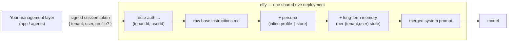

effy is a base for building **per-user agents on shared, multi-tenant infrastructure**. One deployment serves every user. Each session is scoped to a verified `(tenant, user)` and personalized with that user's persona, standing instructions, long-term memory, and personal tools.

The agent itself stays deliberately **raw** — a small, stable base prompt and a handful of tools. Everything tenant-specific is layered on per session, so the same binary can back an unlimited number of distinct assistants.

effy is built on the [eve](https://eve.dev) agent framework. eve has no built-in tenant subsystem; effy composes one from a few eve primitives.

## The idea

A management layer (your app) authenticates a user and hands effy a short-lived, signed session token. effy turns that token into a verified `(tenantId, userId)` and assembles the system prompt for the turn.

Every turn's system prompt is assembled from three layers:

1. **Raw base** — `agent/instructions.md`. Stable, identical for everyone.
2. **Persona** — the user's name, personality, and standing instructions. *Trusted configuration*, authored by your management layer.
3. **Long-term memory** — durable facts saved for that user. *Untrusted data*, fenced behind an explicit trust boundary in the prompt.

The tenant and user are **always** read from verified route auth — never from the model, a tool argument, or a remote response.

## What you get

<Columns cols={2}>
  <Card title="Multi-tenancy by composition" icon="building" href="/concepts/multi-tenancy">
    A verified `(tenant, user)` scopes memory, persona, sandbox, and tooling. No tenant can read or write another's data.
  </Card>
  <Card title="Per-user personas" icon="masks-theater" href="/concepts/personas">
    Personalize the raw base agent per session, by signed token parameter or from a persisted profile store.
  </Card>
  <Card title="Long-term memory" icon="brain" href="/concepts/memory">
    Agentic memory in Supermemory: consolidated per user, recalled each turn as untrusted data behind a trust boundary.
  </Card>
  <Card title="Per-user dynamic tools" icon="wrench" href="/concepts/custom-tools">
    Users author their own tools. Code runs as data in the caller's sandbox, scoped so no one else can see or run it.
  </Card>
</Columns>

## When to use effy

effy fits when **one agent backend must serve many distinct users or organizations**, each with its own identity, memory, and customization — a SaaS assistant, an in-app copilot, or a white-label agent. If you only ever serve a single user or a single shared assistant, you do not need the tenancy layer.

## Next steps

<Columns cols={2}>
  <Card title="Quickstart" icon="rocket" href="/quickstart">
    Run effy locally and talk to it in under five minutes.
  </Card>
  <Card title="Architecture" icon="sitemap" href="/architecture">
    How a turn is assembled, end to end, with sequence diagrams.
  </Card>
  <Card title="Call effy from your app" icon="code" href="/guides/sdk">
    Use the eve TypeScript SDK to drive effy from your backend.
  </Card>
  <Card title="Authentication" icon="key" href="/guides/authentication">
    The session token contract and how to mint one.
  </Card>
</Columns>
